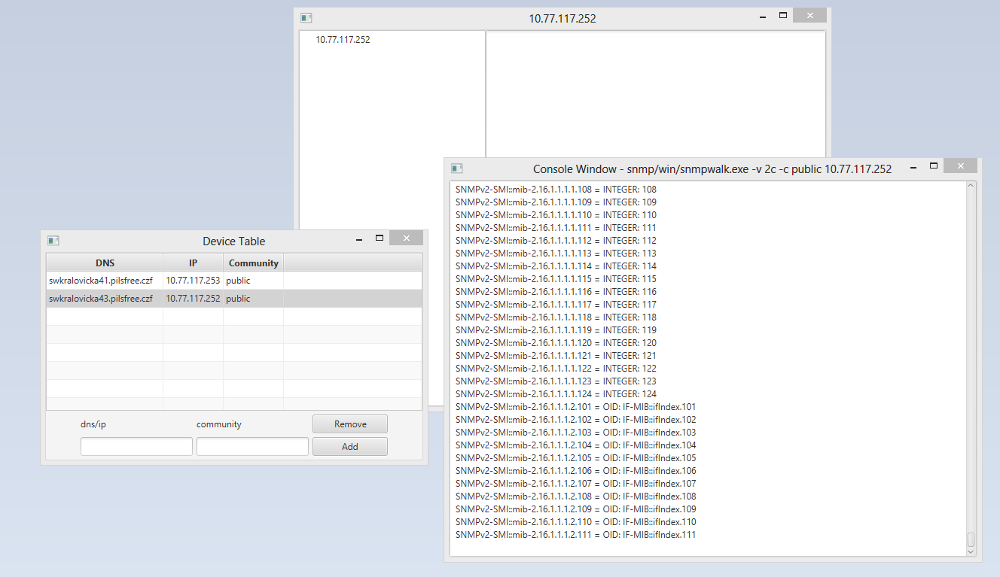
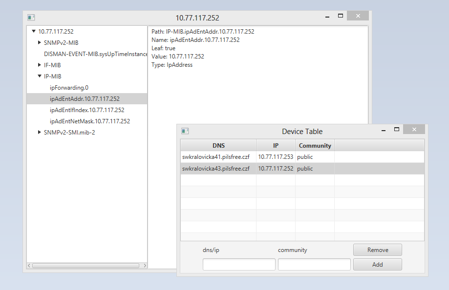
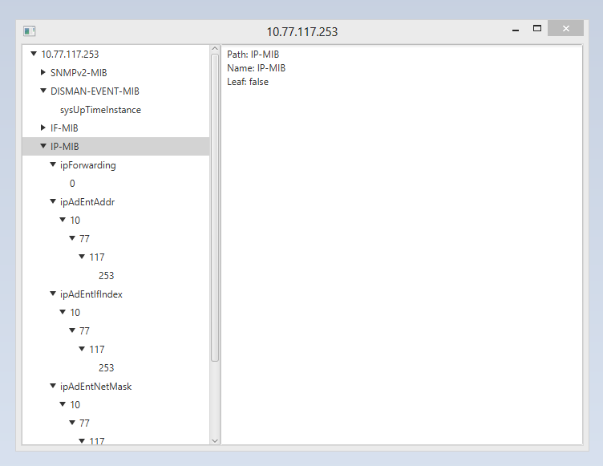
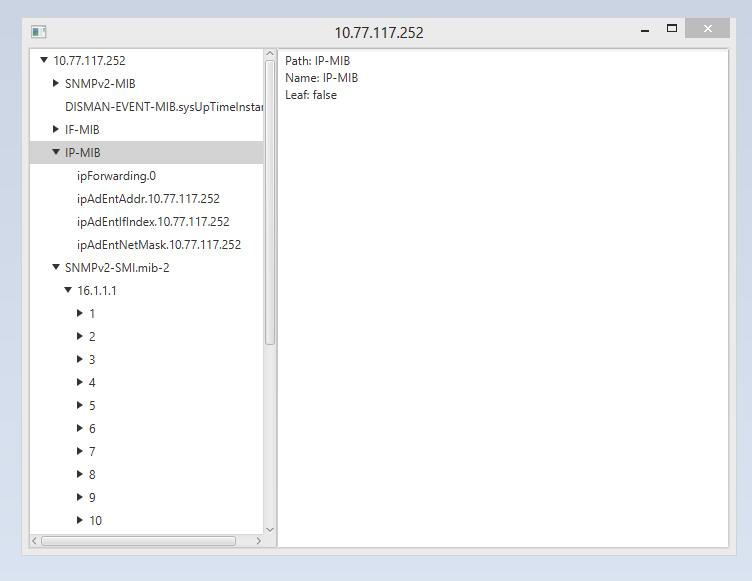

## SNMP Tree Editor

### Beh programu 

 - hlavni okno obsahuje tabulku hostu
 - Pro vybraneho hosta vytvori hlavni okno dve okna
   * okno stromu zarizeni
   * okno s bezici instanci **snmpwalk** a s vypisem do konzole
 - po dobehnuti **snmpwalk** preda okno konzole vystup z programu oknu se stromem
 - okno s konzoli zmizi
 
   

<!-- language: lang-none -->

    ----------------
    | Device Table | ---------------
    ----------------               |
           |                       |
           V                       V
    ----------------        ------------------ 
    | Device Tree  | <------| Console Window |
    ----------------        ------------------    
                                   | 
                                   |
                                   X
                                   
## Snimky obrazovek

 ##### beh konzole   

 
 
 #### po nacteni stromu
 
 
 
                                   
### optimalizace stromu       
 
 - hodne polozek ve strome ma jenom jednoho potomka
 - reseni => sloucime je do jednoho prvku rekurzi
 
 Pred optimalizaci          |  Po optimalizaci
 :-------------------------:|:-------------------------:
   |  
                            
                                   
### Co chybi dodelat          
  
  - dodatecne info v hlavnim okne
     * ping
     * dostupnost
  - zapis hodnoty
     * interface v okne se stromem
     * zavolani programu **snmpset**, pravdepodbne v kombinaci s kozolovym oknem 
    